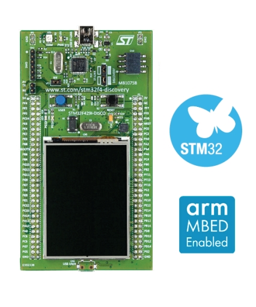

# Hardware-implementation-of-EFMPlus-modulation-code
EFMPlus is the channel code used in DVDs and SACDs.  The EFMPlus encoder is based on a deterministic finite automaton having four states, which translates eight-bit input words into sixteen-bit codewords. The binary sequence generated by the finite state machine encoder has at least two and at most ten zeros between consecutive ones, which is the same as in classic EFM. There are no packing (merging) bits as in classic EFM.  EFMPlus effectively reduces storage requirements by one channel bit per user byte, increasing storage capacity by 1/16 = 6.25%. Decoding of EFMPlus-generated sequences is accomplished by a sliding-block decoder of length two, that is, two consecutive codewords are required to uniquely reconstitute the sequence of input words.
# Hardware
The project was impleneted using STM32F429ZI
